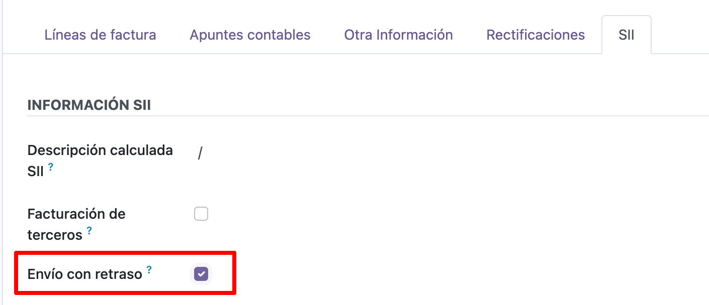
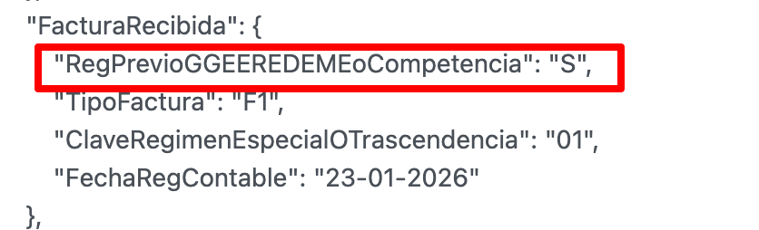

Cuando se valida una factura automáticamente envia la comunicación al
servidor de AEAT.

Envío con retraso
------------------
Permite agregar el identificador 'RegPrevioGGEEREDEMEoCompetencia' en el json que se envía a SII,
y asi informarle a la AEAT que el retraso no es una omisión deliberada, sino fruto de la complejidad del alta inicial y
la configuración del entorno productivo.

1. Ir a Facturación/Contabilidad > Clientes > Facturas de clientes
2. Cree o seleccione una factura.
3. Vaya a la pestaña SII y marque la opción de 'Envío con retraso'.

  

4. Confirme la factura.
5. Cuando se envíe la factura al SII se añadirá el identificador 'RegPrevioGGEEREDEMEoCompetencia'.

  

Para las facturas de proveedores y rectificativas, se realiza el mismo procedimiento.
