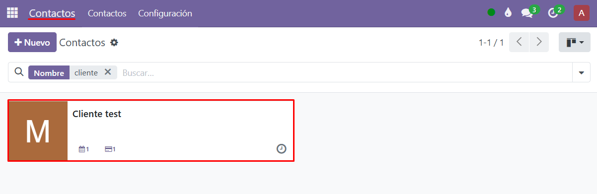
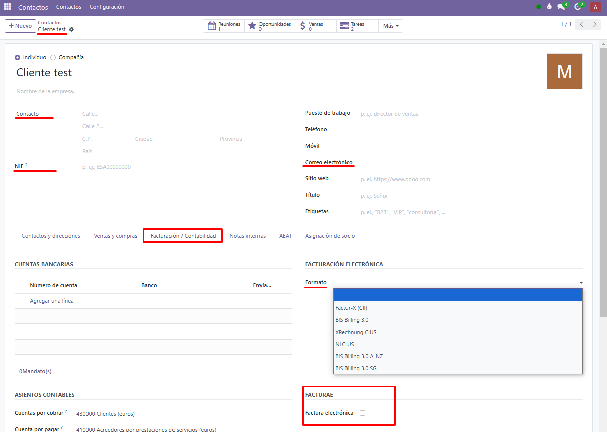
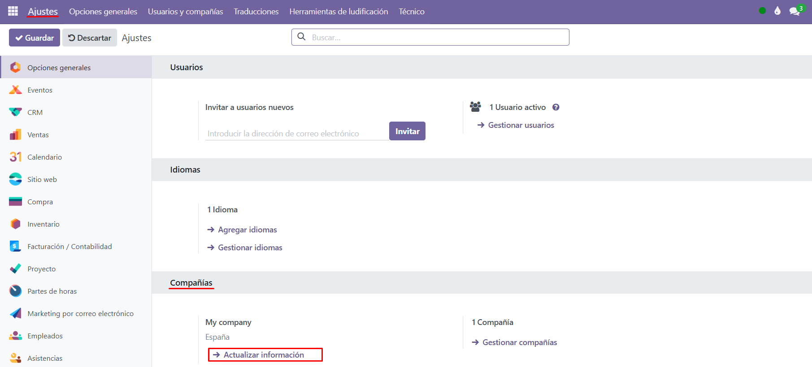
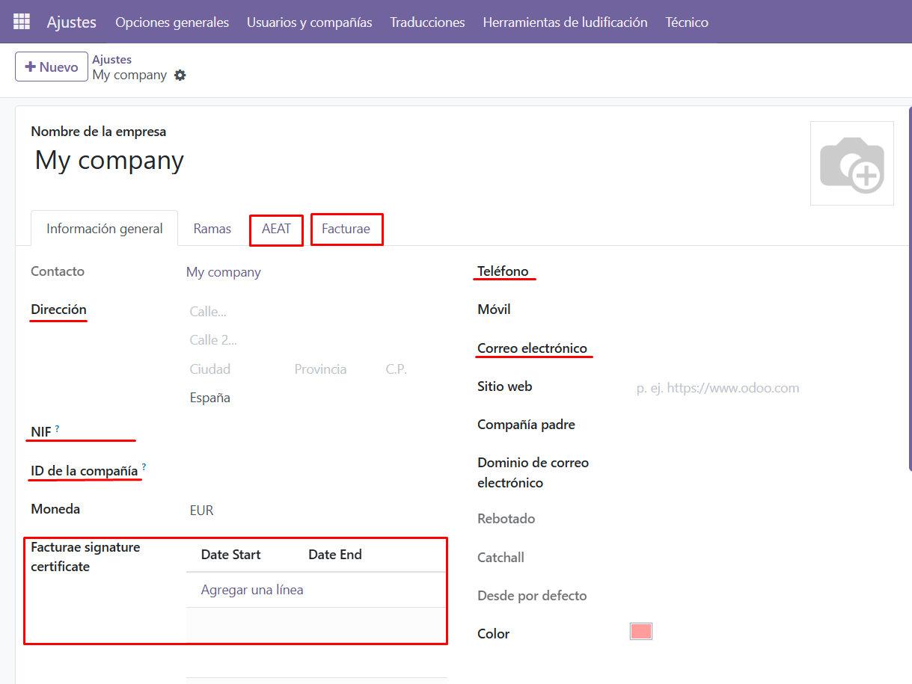
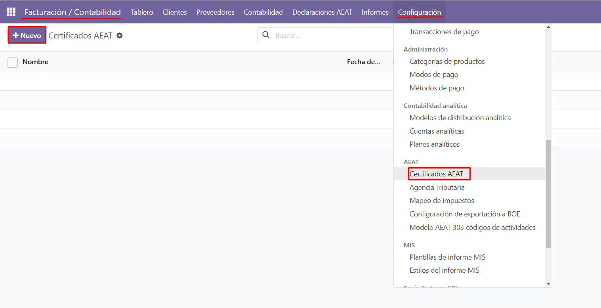
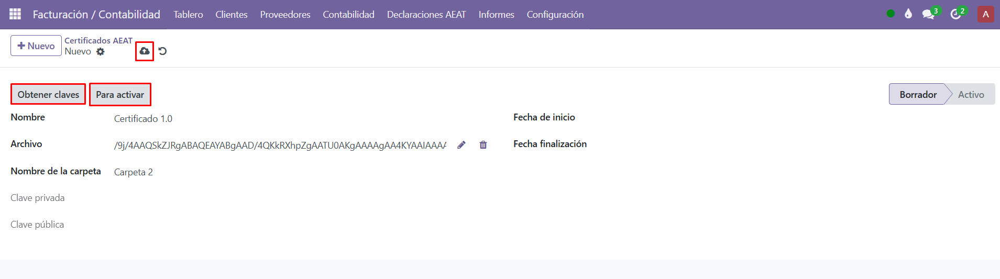
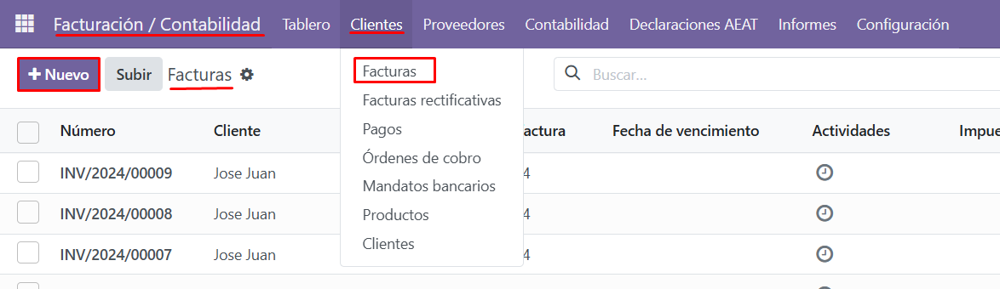
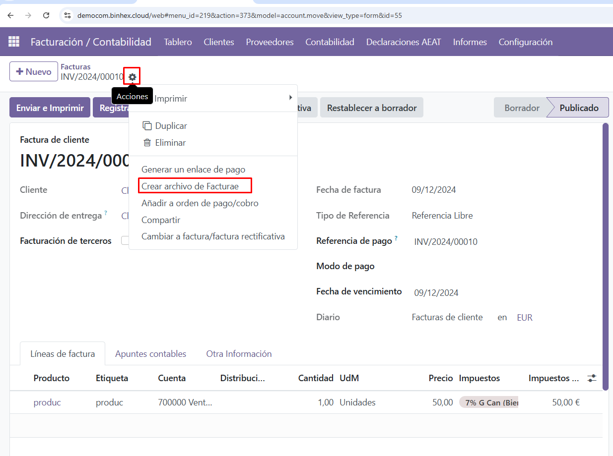
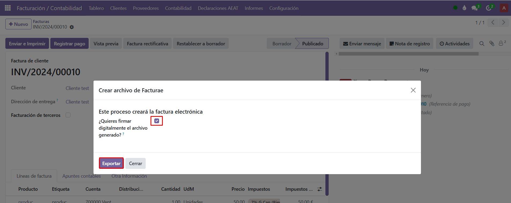

La facturación electrónica es un paso fundamental para cumplir con las normativas actuales y agilizar los procesos administrativos. A continuación, detallamos los pasos necesarios para configurar correctamente el sistema y emitir facturas electrónicas utilizando este módulo.

Pasos para comenzar a utilizar la facturación electrónica:

1. **Configurar los contactos a los que se emitirá facturación electrónica**

El primer paso es configurar los contactos de los clientes a los que se enviará la facturación electrónica. Para ello, dirígete al menú de **Contactos**, selecciona la **ficha del cliente** correspondiente y accede a la sección de **Facturación/Contabilidad**, específicamente al apartado de **Facturae**. 

Aquí debes **activar la casilla** correspondiente, seleccionar la **versión de Facturae** que utilizarás y añadir los **códigos** necesarios para completar esta configuración.

2. **Completar la información de la compañía propia:**

Una vez configurados los contactos, es importante asegurarse de que la información de tu propia compañía esté completa. Para ello, accede a la ficha de tu empresa en **ajustes** y añade todos los datos requeridos, incluyendo la **versión de Facturae** que utilizarás. 

Este paso es fundamental para que las facturas electrónicas se generen correctamente y cumplan con los estándares exigidos.

3. **Añadir el certificado digital:**

El siguiente paso es cargar el certificado digital, que es indispensable para firmar las facturas electrónicas. Ve a la sección de **Facturación/Contabilidad**, accede al apartado de **Configuración** y selecciona Certificados AEAT. 

En esta pantalla, haz clic en **Nuevo** para crear un registro para tu certificado. 

Asígnale un nombre y sube el archivo correspondiente. Una vez cargado el certificado, haz clic en la opción de **Obtener claves** y guarda los cambios.

4. **Descarga el archivo de facturae**

Con esta configuración lista, ya puedes proceder a emitir tus facturas electrónicas. Para ello, accede a **Facturación/Contabilidad**, entra en el menú de **Clientes** y selecciona **Facturas**. 

Haz clic en **Nuevo** para crear una nueva factura. Completa toda la información necesaria, guarda los datos, y luego selecciona el icono de **engranaje de Acción**. 

Aquí encontrarás la opción para descargar el archivo de la factura electrónica. Si es necesario, firma el archivo antes de descargarlo. 

Finalmente, una vez que tengas el archivo listo, puedes subirlo al portal FACe para completar el proceso.

Siguiendo estos pasos, podrá configurar correctamente su sistema para emitir facturas electrónicas conforme a los requisitos actuales. Este proceso asegura que su empresa cumpla con las normativas y facilite el intercambio de información con las administraciones públicas. Si tiene dudas adicionales, no dude en contactarnos para recibir soporte.

